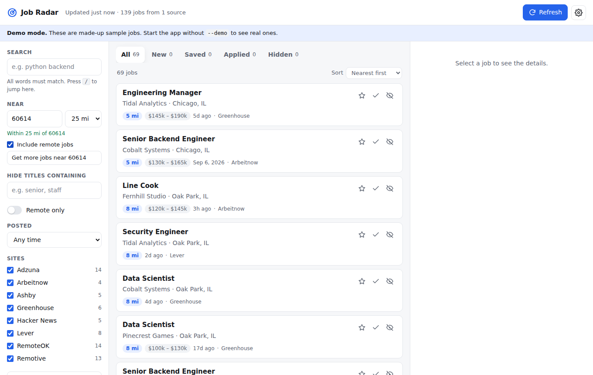

# Job Radar

Job Radar is an app that collects job openings from many sites into one list. You can search it, filter it by distance from a US ZIP code or city, and track which jobs you've saved or applied to. It runs on your own computer and opens in your web browser.



There are three ways to use it:

| | Best for | Needs Python? |
|---|---|---|
| **[Program](#the-program-windows-mac-linux)** | Your own computer, and changing settings from inside the app | No |
| **[Website](#the-website)** | Checking jobs from any device, including your phone | No |
| **[From the source code](#start-the-app-from-the-source-code)** | Developers | Yes |

## The program (Windows, Mac, Linux)

Download it from the **[Job Radar release page](https://github.com/Apocalyptov4/startbootstrap-stylish-portfolio/releases/tag/job-radar)**. GitHub builds a new version automatically whenever the code changes.

* **Windows:** unzip `JobRadar-Windows.zip`, then double-click `JobRadar.exe`. If you see "Windows protected your PC", click **More info** and then **Run anyway**.
* **Mac (M1 or newer):** unzip `JobRadar-macOS.zip`, then double-click `JobRadar`. If macOS says it can't verify the developer, go to **System Settings → Privacy & Security**, click **Open Anyway**, and open it again.

A small window opens and Job Radar appears in your browser. Keep the window open while you use the app, and close it to quit. If you double-click the program while it's already running, it opens the existing copy.

These warnings appear because the program isn't signed with a paid Microsoft or Apple developer certificate. The build steps are in `.github/workflows/job-radar-program.yml` and `packaging/`.

## The website

GitHub rebuilds the website every 6 hours with the latest jobs and publishes it with GitHub Pages at <https://apocalyptov4.github.io/startbootstrap-stylish-portfolio/>.

* It collects jobs within 50 miles of 08088. You can change the ZIP, miles and kind of job instantly, but only within what it has collected. Searching any other ZIP live needs the program, because the website can't call Adzuna without publishing your key.
* The search areas, job sites and companies it covers are set in [`sources.json`](sources.json). Edit that file on GitHub to change them. The **Edit on GitHub** button in the website's Settings takes you there.
* Saved, applied and hidden marks are kept in the browser you set them in. Your phone and your laptop keep separate lists.
* **New** shows jobs that appeared since your last visit.
* Anyone with the link can see the job list. Your marks are never uploaded.
* **My resume** and resume tailoring work on the website too, and your resume stays in your browser. See [Your resume and applying](#your-resume-and-applying).

One-time setup in the repository on GitHub:

1. **Actions** tab → click **"I understand my workflows, go ahead and enable them"**. This step is only needed because this repository is a fork.
2. **Settings → Pages → Build and deployment → Source:** choose **GitHub Actions**.
3. Get the code onto the `master` branch. GitHub only publishes websites from the default branch.
4. For local jobs from Adzuna: **Settings → Secrets and variables → Actions → New repository secret**. Add `ADZUNA_APP_ID` and `ADZUNA_APP_KEY` with your free codes from [developer.adzuna.com](https://developer.adzuna.com/signup). Then add your ZIP code to `"areas"` in `sources.json`, for example `{"where": "60614", "miles": 25, "what": ""}`.

The Adzuna codes stay in GitHub's private secrets storage and are never written to the published site.

To build the website on your own computer: `python -m jobscraper.site -c sources.json -o _site`, then open `_site/index.html` through any web server.

## Start the app from the source code

You need [Python 3](https://www.python.org/downloads/) installed. On Windows, tick "Add python.exe to PATH" during installation.

* **Windows:** double-click `start.bat`.
* **macOS:** double-click `start.command`. The first time, you may need to right-click it and choose **Open**.
* **Linux or a terminal:** run `./start.command`, or `pip install -r requirements.txt` followed by `python -m jobscraper ui`.

The app opens at <http://127.0.0.1:8765>. It keeps running while that window is open. Close the window, or press Ctrl+C, to stop it.

To try the app with made-up sample jobs, start it with `python -m jobscraper ui --demo`. This works without an internet connection.

## What you can do in the app

* **Refresh** checks every site you follow and shows the combined list, with duplicate postings removed and the newest first.
* **ZIP code or city + miles + kind of job:** the main search, at the top of the sidebar. It starts at your first search area (08088, 50 miles). Each job shows how far away it is, and **Nearest first** sorts by distance. Remote jobs are included unless you untick **Include remote jobs**. Places outside the US fall back to matching the location text.
* **Search** (program only) asks Adzuna right away for the ZIP, miles and kind of job you picked. Pressing Enter in the ZIP box does the same. Results are added to what's already loaded, and the place is remembered as a search area so later refreshes keep it up to date. The first search area, your home, is always kept; when there are more than 10, the oldest other one is dropped.
* **Kind of job** uses Adzuna's categories (Healthcare & Nursing, Retail, Logistics & Warehouse, and so on). Jobs from other sources are sorted into a kind by their title.
* **Search and filter** by keyword, remote only, posting date and site. You can also hide titles containing certain words, such as "senior".
* **Save** (star), **Mark applied** (check mark) or **Hide** (crossed-out eye) any job. The tabs across the top list each group.
* The **New** tab shows jobs that appeared since your last refresh.
* **Click a job** to see its details, then use **Open job posting** to apply on the company's site.
* **Settings** (gear icon) lets you add **search areas** (a ZIP code or city, a distance, and optional keywords such as "nurse"), enter your Adzuna codes, turn job sites on or off, and follow specific companies. To follow a company, paste a careers link such as `jobs.lever.co/spotify`, `boards.greenhouse.io/stripe` or `jobs.ashbyhq.com/notion`.
* **Get more jobs near …** appears under the Near box when you search a place that isn't one of your search areas yet. It adds the place as an area and refreshes.

## Your resume and applying

These work on the website and in the program.

* **My resume** (top right) keeps your resume. Upload a PDF, Word (`.docx`) or text file, or paste the text. You can keep several versions and pick which one is your main resume. Each stored resume has a **Download** button, so the original file is always ready to attach on a job site.
* **Match score:** when you click a job, its details show how well your main resume matches it, which of the job's keywords your resume already has, and which are missing. This is free and happens on your own device.
* **Tailor my resume** uses Claude, Anthropic's AI, to fit your resume to one job and write a matching cover letter. Open the job posting, copy the whole description, paste it into the Tailor window and click **Tailor my resume**.
  * Claude only rewords and reorders what's already on your resume. It doesn't add jobs, skills, licenses or degrees you don't list. If the job asks for something your resume doesn't show, the app lists it separately and warns you not to claim it unless it's true.
  * You get the tailored resume and cover letter as Word files (named like `Jane Doe - Resume - Acme Health.docx`), or open them and click **Save as PDF / Print** to make a PDF.
  * Each tailored version is saved with the job it was made for, under the job's details, so you can download it again later.
  * Read it over before you send it.
* **Copy for Claude.ai**, in the same window, is the option without an API key: it copies the same instructions, your resume and the job description, and you paste them into a chat at [claude.ai](https://claude.ai). That uses your Claude plan instead.

Tailoring inside Job Radar needs an Anthropic API key, which is separate from a Claude.ai plan. Sign in at [console.anthropic.com](https://console.anthropic.com/), add a payment method or credits under **Billing**, and create a key under **API keys**. Then:

* **Website:** paste the key in the Tailor window and click **Save key**.
* **Program:** open **Settings**, paste the key under **Resume tailoring (AI)** and click **Save & refresh**.

Each tailored resume usually costs about 10–30 cents, and the app shows the cost after each one.

Where things are kept:

* **Website:** your resumes, tailored versions and API key stay in the browser you added them in. They're never uploaded to the website or to GitHub, and anyone else opening the website sees nothing of yours. Your phone and your laptop keep separate copies. Keep your original resume file too, because clearing the browser's data removes them. When you tailor, your resume and the job description go from your browser straight to Anthropic.
* **Program:** in the app's data folder on your computer (below). The key is never shown in the page.

Your settings, the jobs found, your saved, applied and hidden marks, your resumes and tailored versions are stored in the `~/.jobscraper` folder on your computer. Use `--data-dir` to store them somewhere else.

Other options: `--port 8766` if port 8765 is already in use, and `--no-browser` to stop the app opening a browser tab.

---

## How it gets the jobs

It uses each site's **public JSON API** and does not parse HTML pages. That makes it faster and more reliable than HTML scraping, and it stays within what these sites allow.

| Source | What it covers | Config key |
|---|---|---|
| [Adzuna](https://www.adzuna.com) | Jobs in every industry from thousands of employers and job sites, searched around each of your areas. Needs free codes from [developer.adzuna.com](https://developer.adzuna.com/signup). | `areas`, `adzuna` |
| [RemoteOK](https://remoteok.com) | Remote jobs, mostly tech | `boards.remoteok` |
| [Remotive](https://remotive.com) | Remote jobs, all categories | `boards.remotive` |
| [Arbeitnow](https://www.arbeitnow.com) | Europe and Germany, including visa-sponsored roles | `boards.arbeitnow` |
| Hacker News "Who is hiring?" | Top-level posts in the latest monthly thread | `boards.hackernews` |
| [Greenhouse](https://www.greenhouse.com) | Career pages of any company on Greenhouse | `companies.greenhouse` |
| [Lever](https://www.lever.co) | Career pages of any company on Lever | `companies.lever` |
| [Ashby](https://www.ashbyhq.com) | Career pages of any company on Ashby | `companies.ashby` |

Most tech companies host their careers page on Greenhouse, Lever or Ashby. To track a company, find its slug in the careers URL and add it to your config:

```
boards.greenhouse.io/<slug>   or  job-boards.greenhouse.io/<slug>  -> "greenhouse"
jobs.lever.co/<slug>                                               -> "lever"
jobs.ashbyhq.com/<slug>                                            -> "ashby"
```

### Search areas and Adzuna

Each search area is one Adzuna search: up to `max_pages` × 50 of the newest jobs within `miles` of `where`, optionally narrowed by `what`. Each refresh fetches only the newest jobs, so area jobs from earlier refreshes are kept for up to 21 days while that area is still in your settings. This builds up a fuller local list over a few refreshes.

Adzuna's free plan limits how many requests you can make. Each page of 50 jobs is one request, and the website makes up to `max_pages` per area every 6 hours. If you add many areas, lower `max_pages` or use keywords. When the limit is reached, Adzuna is skipped with a clear message and the other sources still load.

### Placing jobs on the map

Distances use US ZIP code and city centre points from the [`zipcodes`](https://pypi.org/project/zipcodes/) package (MIT License, in `jobscraper/data/`). Adzuna gives each job's position directly. For other sources, the position is worked out from location text such as "Austin, TX" or "New York, NY 10001". Jobs whose location can't be placed, such as "Remote" or anything outside the US, don't appear in a Near search, except for remote jobs when **Include remote jobs** is ticked.

## Command-line version

The same search also works in a terminal without the app. This is useful for scripts and scheduled digests.

```bash
# All default boards (RemoteOK, Remotive, Arbeitnow, HN), newest first
python -m jobscraper

# Remote Python or Django jobs from the last 7 days, excluding senior roles
python -m jobscraper -k python -k django --remote --days 7 -x senior -x staff

# Include the companies listed in your config, and save a searchable HTML page
cp sources.example.json sources.json      # then edit the company lists
python -m jobscraper -c sources.json -k "data engineer" -f html -o jobs.html

# Only query some sources
python -m jobscraper -c sources.json -s greenhouse,lever -l berlin -l remote

# Daily digest: print only postings not seen in earlier --new-only runs
python -m jobscraper -c sources.json -k rust --new-only -f md
```

### Options

| Flag | Meaning |
|---|---|
| `-k, --keyword` | Keep jobs that match **any** keyword. Repeatable. Matches whole words, so `java` does not match JavaScript and `go` does not match Google. Searches the title, company, tags and description. |
| `--title-only` | Match keywords against the title only. |
| `-x, --exclude` | Drop jobs whose title contains this word. Repeatable. |
| `-l, --location` | Keep jobs whose location contains this text. Repeatable. `remote` also matches jobs flagged as remote. |
| `--remote` | Remote jobs only. |
| `--days N` | Only jobs posted in the last N days. Jobs without a date are kept. |
| `-s, --sources` | Comma-separated subset: `remoteok,remotive,arbeitnow,hackernews,greenhouse,lever,ashby`. |
| `-f, --format` | `table` (default), `csv`, `json`, `md`, or `html` (a standalone page with a live filter box). |
| `-o, --output` | Write the output to a file. |
| `-n, --limit` | Show at most N jobs. |
| `--new-only` / `--state` | Show only postings not seen before. Seen postings are stored in `.jobscraper-seen.json`. |
| `-v` | Print progress for each source to stderr. |

If a source fails (site down, rate-limited, wrong slug), the run continues. The failure is reported at the end. When the same role is posted on several sites, it appears once.

## Running it on a schedule

Example cron entry for a daily email digest:

```cron
0 8 * * *  cd ~/job-scraper && python -m jobscraper -c sources.json -k python --new-only -f md | mail -s "New jobs" you@example.com
```

## Adding a new source

1. Subclass `Source` (a whole job board) or `CompanySource` (one company on an ATS) in `jobscraper/sources/`.
2. Implement `fetch(session)` so it yields `Job` objects.
3. Register the class in `jobscraper/sources/__init__.py`.
4. Add a fixture and a parsing test in `tests/`.

## Tests

```bash
python -m unittest -v      # offline; all HTTP responses come from tests/fixtures
```

If Node.js is installed, this also runs the tests for the browser code in `tests/js` (or run `node --test tests/js/resume_tools.test.js`).

The website also needs two browser libraries, the Anthropic SDK and pdf.js, at the versions pinned in `web-vendor/package-lock.json`. The website build installs them; to build the website yourself, run `npm ci && npm run build` in `web-vendor/` first.

## Project layout

```
jobscraper/
  sources/     one module per kind of site; each yields Job objects
  scraper.py   fetches all sources in parallel, then filters, de-duplicates and sorts
  server.py    the local web app's server and JSON API (standard library only)
  web/         the app's page: index.html, style.css, app.js (no build step)
    apply.js         My resume, match score and tailoring screens
    resume-tools.js  match score, reading Word files, and the Word and printable versions
    resume-local.js  the website's resume storage (in the browser) and its Claude requests
  resumes.py   the program's stored resumes and reading text from PDF, Word and text files
  tailor.py    resume tailoring with the Claude API (the program's requests, and the settings the website uses)
  applying.py  ties the above together for the program
  cli.py       the command-line version
  site.py      builds the static website version
packaging/     how the one-file program is built (PyInstaller)
web-vendor/    builds the browser libraries the website loads (Anthropic SDK, pdf.js)
sources.json   job sites and companies the website covers
```

## Be a good citizen

* RemoteOK and Remotive ask you to link back to them when you show their listings. Remotive also asks for no more than about 4 requests a day.
* Keep the run frequency sensible. Once or a few times a day is plenty.
* This tool deliberately does not scrape LinkedIn, Indeed or Glassdoor. Their terms forbid automated scraping, and they actively block it.
